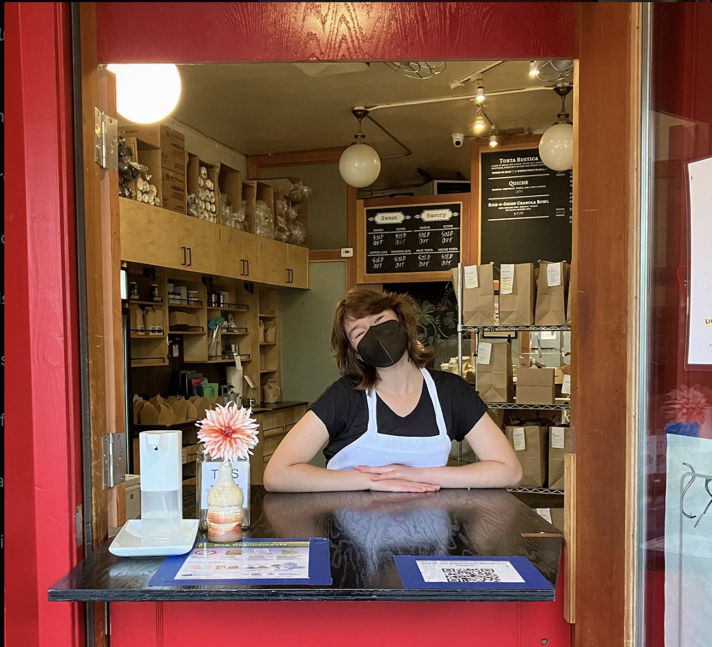
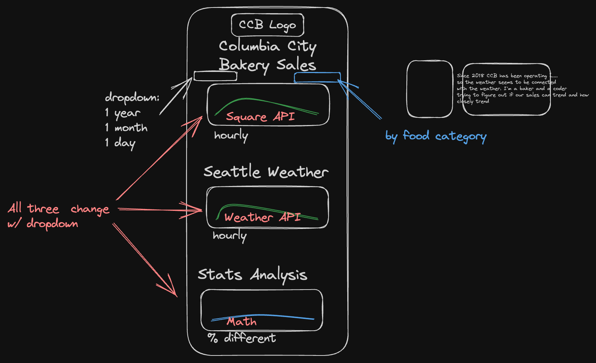

# CCB-and-the-Weather
Check it out here: [website coming]

## Description

This simple website was created by a coder and a baker (who also codes) and works at the Columbia City Bakery (CCB) to test hypothesis that the weather is directly tied to our sales. Since the very start of Covid, CCB has operated with only a murphy door instead of a cafe leaving customers momentarily outside. It has been the baker's observation that sales slow down when the weather is worse and she wanted to see what kind of trending could be down if the future weather is known to prevent food waste and unnecessary manpower.

## Table of Contents: 
- [CCB-and-the-Weather](#ccb-and-the-weather)
  - [Description](#description)
  - [Table of Contents:](#table-of-contents)
  - [Original Wire-Frame](#original-wire-frame)
  - [Resources](#resources)

## Original Wire-Frame

## Resources
<!-- Square API Resources -->

https://github.com/square/square-nodejs-sdk/blob/master/README.md#sdk-reference

https://developer.squareup.com/docs/sdks/nodejs/quick-start

https://developer.squareup.com/docs/square-get-started#step-1-create-an-account-and-application

<!-- Weather API Resources -->

https://openweathermap.org/api

https://openweathermap.org/history-bulk

https://openweathermap.org/history

https://dev.meteostat.net/

